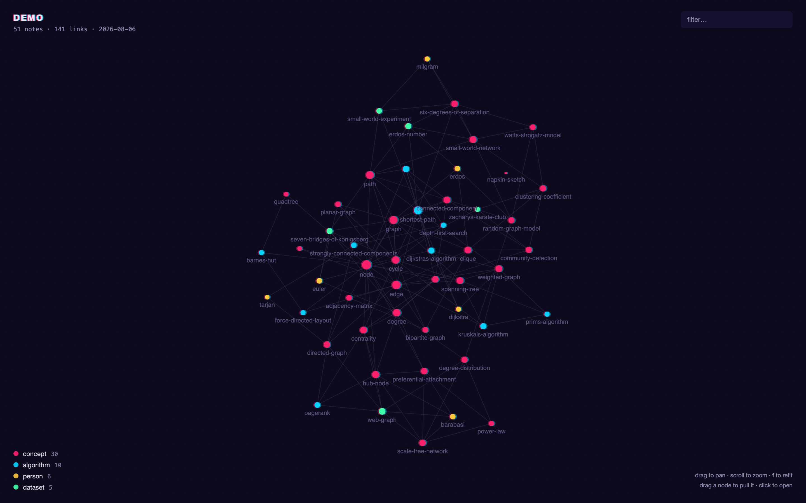
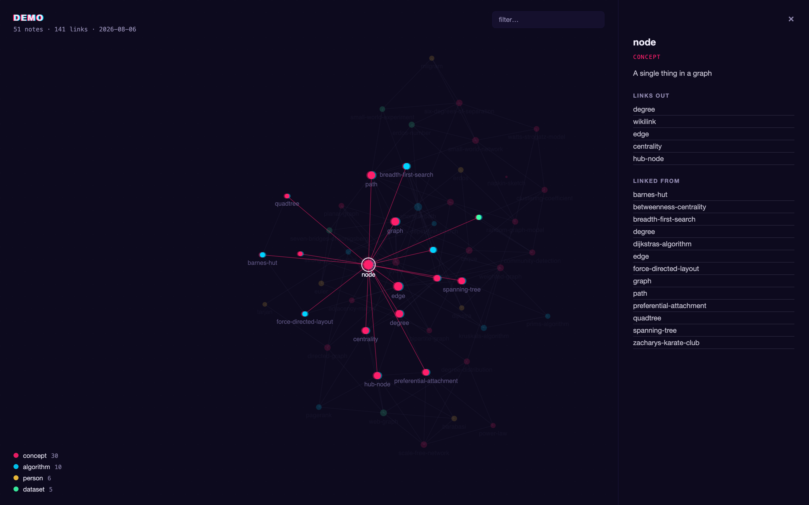
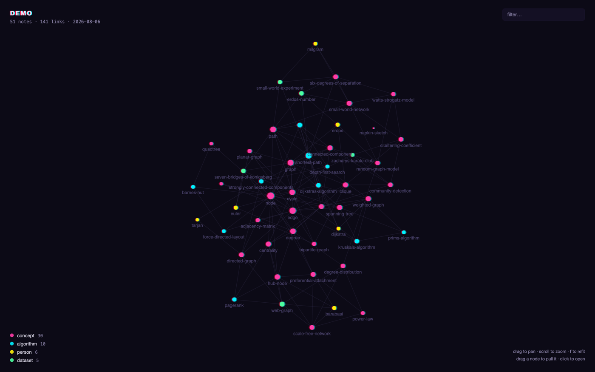
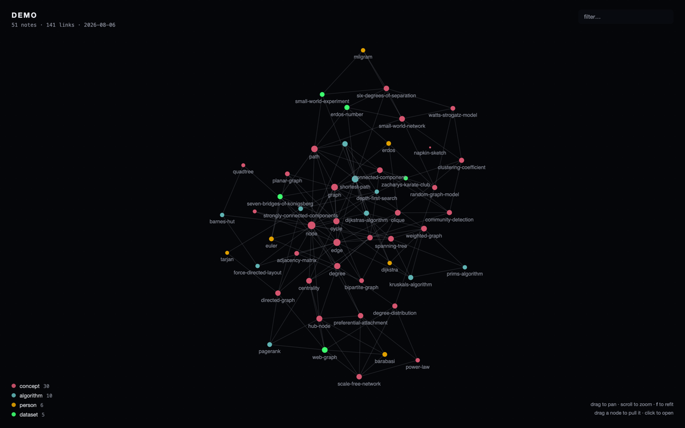
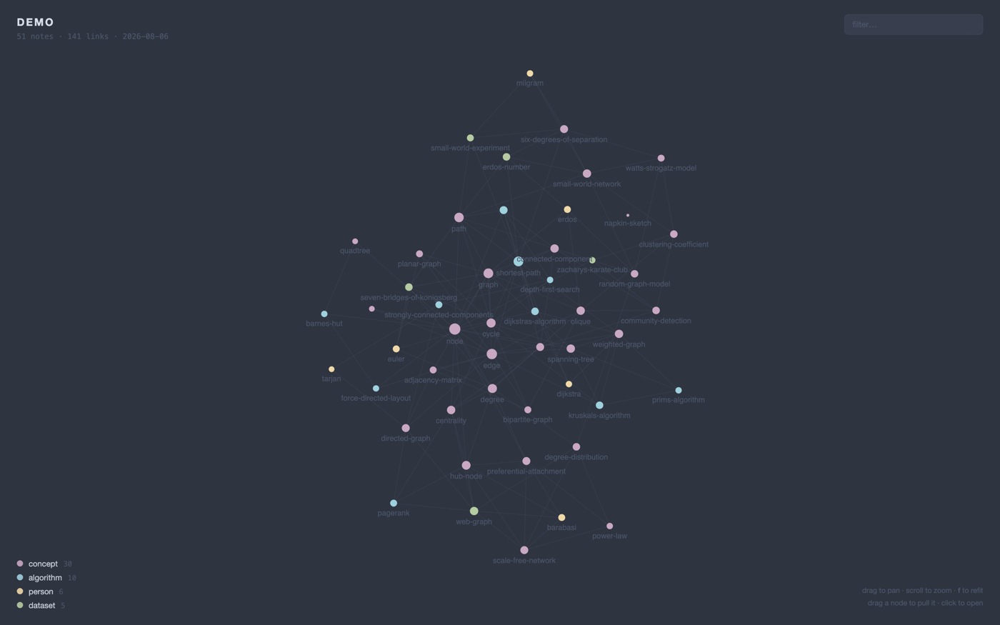
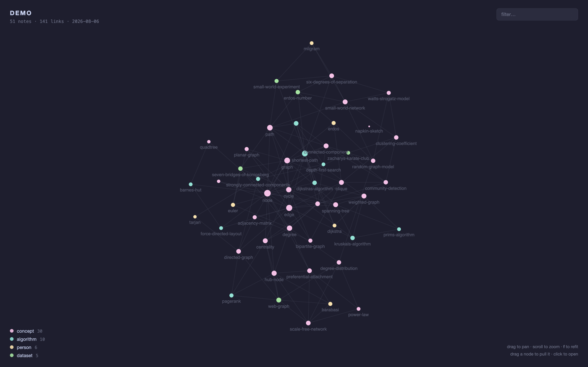
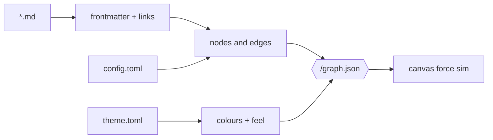

```
 ███╗   ██╗  ██████╗  ██╗   ██╗ ███████╗
 ████╗  ██║ ██╔═══██╗ ██║   ██║ ██╔════╝
 ██╔██╗ ██║ ██║   ██║ ██║   ██║ ███████╗
 ██║╚██╗██║ ██║   ██║ ██║   ██║ ╚════██║
 ██║ ╚████║ ╚██████╔╝ ╚██████╔╝ ███████║
 ╚═╝  ╚═══╝  ╚═════╝   ╚═════╝  ╚══════╝
```

<div align="center">

### `YOUR NOTES, AS A SHAPE`

*point it at a folder of markdown. it follows the links and draws what it finds.*




*the `demo/` vault in this repo — 51 notes about graph theory, drawn as a graph*

</div>

---

## 🧠 What is this

Obsidian's graph view is the best thing in Obsidian and it only works on Obsidian
vaults. `nous` is that view as a command: give it any directory of markdown, and
it reads the frontmatter, follows every `[[wikilink]]` and relative markdown
link, and serves the result as a force graph on localhost. One node per note,
sized by how many links it has, coloured by whichever frontmatter field you say.

It re-reads the directory on every request, so refreshing the browser shows the
notes as they are now. `nous build` writes the same graph to a single HTML file
with the data inlined — no server, no dependencies, no requests — which is the
version you send to someone.

Themes are TOML. They set the palette, the colour per note type, and the parts
that are taste rather than data: node size, label size, glow, halftone, and a
duotone offset that prints two plates slightly out of register behind every node.
Eleven ship, converted from the [swatch](https://github.com/nitrimandylis/swatch)
palettes of the same names, though nothing at runtime knows swatch exists. Only
`spider-verse` and `night-city` keep the duotone, both being aesthetics built on a
misregistered print in the first place.

```console
nick@nous:~$ nous ~/notes
notes — 98 notes, 224 links, Spider-Verse
http://localhost:4321   (ctrl-c to stop, refresh to re-read)
[i] the one in the middle with 27 links is the one you should have split up
```

## 📸 Evidence



click a note and everything it does not touch goes quiet. `node` is the busiest one
in the demo vault — 5 links out, 13 in, and it took three sentences to define.

<details>
<summary>the same vault in four other themes</summary>

| | |
|---|---|
|  |  |
| `night-city` — arasaka yellow, and the only other theme that keeps the duotone tear | `mafia` — near-black noir, gold and green tells, halftone on |
|  |  |
| `nord` — the published spec, muted on slate | `catppuccin` — mocha, pastels on warm charcoal |

eleven ship in total. `nous themes` lists them.

</details>

## 🕸️ The graph

| | feature | what it actually does |
|---|---|---|
| 01 | **link parsing** | reads `[[wikilinks]]` and markdown links to local `.md`, resolves them by basename or by path, and drops the ones pointing nowhere (`unresolved = true` draws them as ghosts) |
| 02 | **colour by field** | `group_by` names a frontmatter field, or the literal `folder`. nested yaml still counts — a `type` under `metadata:` is found |
| 03 | **focus mode** | hover a node and the rest of the graph goes quiet, leaving that note and everything it touches |
| 04 | **label culling** | busiest notes claim label space first, anything that would overlap is dropped. zoom in and the rest come back |
| 05 | **orphan anchoring** | a note with no links has nothing holding it against the repulsion, so it gets its own pull to the centre instead of sailing off the canvas |
| 06 | **exclude globs** | an index note that links to everything renders as one hub with a spoke to every note. put it in `exclude` and the real structure appears |
| 07 | **eleven themes** | toml files in `~/.config/nous/themes/`, the file name is the theme name. converted from [swatch](https://github.com/nitrimandylis/swatch) palettes, but standalone — nous never reads swatch. copy one and change the hexes |
| 08 | **stable colours** | a group's colour follows its name, not how common it is. writing three more notes never repaints the legend |
| 09 | **standalone build** | `nous build` inlines the graph into one html file. it opens anywhere and phones nowhere |

## 🚀 Run it

Needs [Bun](https://bun.sh). Nothing else.

```bash
git clone https://github.com/nitrimandylis/nous.git
cd nous
bun run compile   # → ~/.bun/bin/nous, and man nous into your manpath
nous demo         # the vault in this repo, if you want to see it work first
nous ~/notes      # yours
man nous          # full reference, offline
```

First run writes `~/.config/nous/config.toml` and all eleven themes into
`~/.config/nous/themes/`. Set `dir` in the config and `nous` on its own serves it.
An upgrade adds any new theme without touching one you have edited.

`demo/` is 51 notes about graph theory that link to each other — a graph about
graphs. It exists so the screenshots above are not a picture of somebody's
private notes, and so `nous` has something to draw before you have configured
anything. One note in it, `napkin-sketch`, deliberately links to nothing.

There is a `nous-cli/SKILL.md` in the repo for agents driving the tool. `bun run
compile` installs it if `~/.claude/skills` exists. Its whole job is the split that
`--help` cannot express: `nous` starts a server and never exits, so an agent
should hand that command to you and use `nous build --json` itself.

## 🔩 Under the hood



| layer | path | job |
|---|---|---|
| entry | `nous.ts` | flags, config, the four commands, the server |
| reader | `vault.ts` | walks the directory, parses frontmatter, resolves links into a graph |
| themes | `theme.ts` | loads a theme toml, fills the gaps, assigns a colour to every group |
| shipped | `builtin.ts`, `themes/` | the eleven themes, embedded in the binary as text |
| page | `page.html` | the whole renderer: force simulation, canvas, panel. embedded in the binary |

The simulation is O(n²) repulsion in a `requestAnimationFrame` loop — every node
pushes every other node, every frame. At a few hundred notes that is nothing. At
several thousand it wants a quadtree, and that is a problem for whoever writes
notes that fast.

**Stack:** Bun · TypeScript · canvas 2d · TOML · zero runtime dependencies

---

<div align="center">

**[Nick Trimandylis](https://github.com/nitrimandylis)**

`THE MAP IS NOT THE TERRITORY BUT IT IS EASIER TO LOOK AT`

MIT licensed.

</div>
